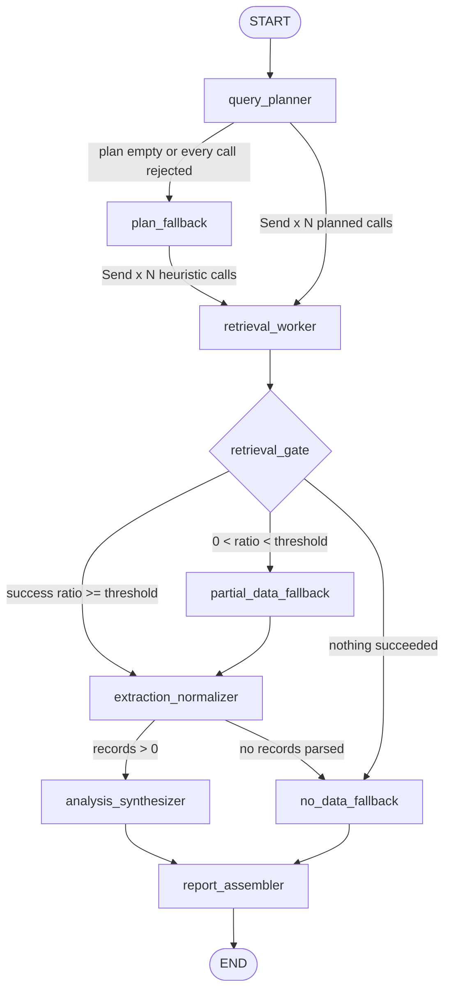

# Agentic Search Intelligence

A LangGraph DAG of single-responsibility agents that answers a search-visibility
question end to end: plan the retrieval, call DataForSEO through typed tool schemas,
normalize the payloads, score the opportunities, and assemble a structured report.
Exposed over a FastAPI service with SQLite persistence.

Built for the AI Agent Engineer assessment. Sections 3-5 of the brief are implemented,
including the circuit-breaker bonus in 3.5.

## Quick start

```bash
make install
make demo
```

Runs with no API keys and no network. `LLM_PROVIDER=fake` uses a deterministic scripted
model that emits real tool calls; `DATAFORSEO_MODE=mock` replays recorded DataForSEO
response envelopes. Same graph, same validation, same fallback edges as live mode.

Serve the API:

```bash
make run     # http://127.0.0.1:8000, docs at /docs
make smoke   # second terminal: drives every endpoint and asserts the results
```

| Command | Description |
| --- | --- |
| `make install` | venv, dependencies, copies `.env.example` to `.env` |
| `make demo` | One full DAG run with metrics and the report |
| `make demo-failure` | Same run with three endpoints forced down |
| `make smoke` | End-to-end API check against a running server |
| `make check-dataforseo` | Probes each DataForSEO endpoint and reports status and cost |
| `make test` | 127 tests |
| `make lint` / `make typecheck` | ruff / mypy |

## Running modes

Two independent switches: which LLM plans the retrieval, and where the search data
comes from. Any combination works.

### Mock mode (default)

No keys, no network, no cost. This is what `make install` configures.

```bash
LLM_PROVIDER=fake DATAFORSEO_MODE=mock make demo
```

### Live mode

Put your own credentials in `.env`:

```bash
LLM_PROVIDER=groq
LLM_MODEL=openai/gpt-oss-120b
GROQ_API_KEY=gsk_...

DATAFORSEO_MODE=live
DATAFORSEO_LOGIN=you@example.com
DATAFORSEO_PASSWORD=...          # API password from app.dataforseo.com/api-access
DATAFORSEO_BASE_URL=https://api.dataforseo.com
```

Then:

```bash
make check-dataforseo   # verify credentials first
make demo               # full run against live APIs
```

Or without editing `.env`:

```bash
LLM_PROVIDER=groq DATAFORSEO_MODE=live make demo
```

### Notes on the live path

**This was tested against the real APIs.** Groq drives the planner, analysis and report
agents; DataForSEO returns live Google SERP, AI Overview and keyword data. A live run
costs roughly $0.10 in DataForSEO credit. The committed default is mock so the project
runs for a reviewer with no accounts and no spend, which the brief explicitly permits.

Two things worth knowing if you point this at your own keys:

- The DataForSEO API password is generated by DataForSEO and shown at
  `app.dataforseo.com/api-access`. It is not your account login password. A `40100`
  status means you used the wrong one, and `40104` means the account is not verified yet.
- Groq retires models regularly. If a run fails with `model does not exist`, list what
  your key can reach: `curl -s https://api.groq.com/openai/v1/models -H "Authorization:
  Bearer $GROQ_API_KEY"`.

## Architecture



Also served at `GET /api/v1/graph`, generated from the compiled graph's node names.

Three conditional routers make this a branching graph rather than a chain:
`_route_after_plan`, `_route_after_retrieval` and `_route_after_extraction` in
[`app/graph/builder.py`](app/graph/builder.py).

### Fan-out

The planner's conditional edge returns a list of LangGraph `Send` objects, one per
planned call. Each becomes its own `retrieval_worker` execution with independent timing,
retry count and failure record. LangGraph joins them at `retrieval_gate`.

A loop inside a single retrieval node would give one timing for all calls, let one
failure take down the successful siblings, and lose per-call traces. The cost of `Send`
is that `invocations` and `retrieval_errors` need reducers
(`Annotated[list, operator.add]`) so parallel branches merge instead of overwriting. See
[`app/graph/state.py`](app/graph/state.py).

## Agent responsibilities

| Node | Responsibility | Does not |
| --- | --- | --- |
| `query_planner` | Decide which API calls are needed and with what arguments | Call any API, interpret results |
| `retrieval_worker` | Execute one validated tool call | Parse payloads, judge them, decide routing |
| `retrieval_gate` | Measure how much of the plan returned | Fetch, parse, route |
| `extraction_normalizer` | Provider payloads into one flat schema | Score, rank, call anything external |
| `analysis_synthesizer` | Aggregate per query, compute scores, produce findings | Fetch data, format the deliverable |
| `report_assembler` | Assemble the final JSON and human-readable report | Re-score, introduce new data |
| `plan_fallback` | Deterministic plan when the model returns nothing usable | Call the model |
| `partial_data_fallback` | Mark a thin run degraded and continue | Retry |
| `no_data_fallback` | Record why the run is empty | Retry, raise |

Two separations that drove the design:

**Planning is separate from execution.** The planner binds the tool schemas and lets the
model choose tools and arguments, but the returned tool calls are captured as a plan, not
executed in place. They are validated and budget-capped first. The model decides what to
call; the graph decides when it happens.

**Scoring is separate from the model.** `opportunity_score` is a pure function in
[`app/scoring.py`](app/scoring.py). The LLM writes narrative; it never produces a number
that ranks a customer's queries. Rankings need to be reproducible and auditable.

### Plan coverage

Models vary in how many tool calls they emit per turn. Testing against Groq's
`openai/gpt-oss-120b`, the planner routinely returned a single call regardless of prompt
wording, and a plan that only knows search volume cannot answer a visibility question.

`_ensure_coverage` adds any missing organic or AI-surface check for the queries the model
named, plus the batched demand call, and records it in `plan_notes` with
`plan_source: "model+topup"`.

It completes coverage of the queries the model chose. It never invents new queries, and
it never fires on an empty plan, which still routes to `plan_fallback`. Three tests pin
that boundary.

## Tool calling

Tools are Pydantic models with types, bounds, descriptions and required fields
([`app/tools/schemas.py`](app/tools/schemas.py)), exported as JSON Schema and bound with
`bind_tools`. One tool per logical endpoint:

| Tool | Endpoint |
| --- | --- |
| `serp_organic_results` | `POST /v3/serp/google/organic/live/advanced` |
| `ai_overview_snapshot` | `POST /v3/serp/google/ai_mode/live/advanced` |
| `llm_answer_visibility` | `POST /v3/ai_optimization/chat_gpt/llm_responses/live` |
| `keyword_search_volume` | `POST /v3/keywords_data/google_ads/search_volume/live` |
| `related_keyword_ideas` | `POST /v3/dataforseo_labs/google/keyword_ideas/live` |

Every proposed call goes through `validate_tool_call` before any HTTP happens
([`app/tools/registry.py`](app/tools/registry.py)):

1. **Alias repair.** Models reliably emit `query` for `keyword` or `prompt` for
   `user_prompt`. A small alias table rewrites a known set, and comma-separated strings
   are coerced into list fields.
2. **Schema validation.** `extra="forbid"`, so a hallucinated argument is a caught
   rejection rather than a silently dropped field.
3. **Fail closed, per call.** A rejection becomes a structured record with field-level
   detail, surfaced in the run response under `rejected_tool_calls`. The rest of the plan
   proceeds. Only an entirely empty plan routes to `plan_fallback`.

```
# One malformed call among four, from tests/test_pipeline.py
rejected_tool_calls = [
  {"type": "ToolValidationError", "tool": "serp_organic_results",
   "detail": {"problems": [{"field": "keyword", "problem": "Field required"}]}},
  {"type": "ToolValidationError", "tool": "nonexistent_tool", ...}
]
status = completed
```

## Failure handling

### Error classification

`app/resilience/errors.py` splits failures into retryable and not, from two sources:

- **HTTP status.** 408/425/429/5xx are transient. 4xx including 401/403 are permanent.
- **DataForSEO body codes.** The API answers `200 OK` and puts the real status in
  `status_code`, at both the response and task level. `20000` is success; `401xx`/`402xx`
  are auth and payment failures; other `4xxxx` are permanent; `40429` and `5xxxx` are
  transient. `_unwrap()` collapses all three levels into one taxonomy.

Non-2xx responses also carry an actionable message in the body, so the client parses it
rather than reporting only the status:

```
HTTP 403 from /v3/serp/google/organic/live/advanced:
  [40104] Please verify your account before using the API.
```

### Retry

Exponential backoff with full jitter, capped, honouring `Retry-After`:

```
delay = uniform(0, min(base_delay * 2^(attempt-1), max_delay))
```

Full jitter rather than equal jitter because every planned call in a fan-out hits the
same upstream simultaneously, so de-correlating them matters more than keeping a floor
under the delay. Permanent errors are not retried. An open circuit aborts the retry loop
immediately instead of sleeping to reach a verdict the breaker already reached.

### Circuit breaker

One breaker per endpoint, so a dead endpoint cannot starve healthy ones. Closed to open
at `CIRCUIT_FAILURE_THRESHOLD` failures; after `CIRCUIT_RESET_TIMEOUT` a single half-open
probe is admitted; success closes it, failure reopens and restarts the cooldown.

### Degradation

`RETRIEVAL_SUCCESS_THRESHOLD` (default `0.5`) decides the route out of the gate:

| Retrieval outcome | Route | Status |
| --- | --- | --- |
| >= threshold succeeded | `extraction_normalizer` | `completed` |
| Some succeeded, below threshold | `partial_data_fallback` then `extraction_normalizer` | `partial` |
| Nothing succeeded | `no_data_fallback` then `report_assembler` | `failed` |

The partial path still runs extraction. Discarding calls that succeeded because their
siblings failed would throw away billed data. The report comes back well-formed either
way with `caveats` naming what is missing. The caller gets 200 with an honest partial
answer, never a 500.

### Simulated failure

```bash
make demo-failure
```

Forces three of the five endpoints down for the whole run:

```
WARNING retrying after transient failure  label=ai_overview_snapshot:/v3/serp/google/ai_mode/live/advanced
                                          attempt=1 max_attempts=4 sleep_seconds=0.266
WARNING retrying after transient failure  attempt=2 sleep_seconds=0.741
ERROR   circuit opened                    dependency=/v3/serp/google/ai_mode/live/advanced failures=5
WARNING aborting, circuit is open         attempt=3
WARNING retrieval below threshold, continuing with partial data
        failed_calls=5 failures_by_tool={'serp_organic_results': 2, 'ai_overview_snapshot': 2,
                                         'llm_answer_visibility': 1}

run  status=partial  degraded=True
path: query_planner -> retrieval_worker x6 -> retrieval_gate -> partial_data_fallback
      -> extraction_normalizer -> analysis_synthesizer -> report_assembler
planned=6 normalized=3 queries=3 recommendations=3
```

The surviving `keyword_search_volume` data is still parsed and reported. Affected queries
come back as `visibility_status: "unknown"` rather than `not_visible`, because a false
negative sends a customer to write content they may not need.

## Observability

Structured JSON logs from every node: inputs (shape, not payload), duration,
success/failure, retry count.

```json
{"ts": "2026-09-05T04:27:34+0500", "level": "INFO", "logger": "app.graph.node",
 "event": "node started", "run_id": "6d25e877-f531-42f5-abf9-5b632c43091e",
 "node": "retrieval_worker", "profile_uuid": "29f0617c-d019-4114-8c6f-ed9d4130eda6",
 "input": {"call_id": "e9acf425-0d01-48f4-88f8-79d73ca97c5e",
           "tool": "ai_overview_snapshot", "query_text": "best seo software"}}
{"ts": "2026-09-05T04:27:34+0500", "level": "WARNING", "logger": "app.resilience.retry",
 "event": "retrying after transient failure", "run_id": "6d25e877-...",
 "label": "ai_overview_snapshot:/v3/serp/google/ai_mode/live/advanced",
 "attempt": 1, "max_attempts": 4, "sleep_seconds": 0.266}
{"ts": "2026-09-05T04:27:34+0500", "level": "INFO", "logger": "app.tools.executor",
 "event": "tool call finished", "run_id": "6d25e877-...", "tool": "keyword_search_volume",
 "endpoint": "/v3/keywords_data/google_ads/search_volume/live",
 "ok": true, "attempts": 1, "duration_ms": 21.38}
```

Tracing is correlation-ID based via `contextvars`, so `run_id`, `node` and `profile_uuid`
attach to every log line without being threaded through function signatures.
`contextvars` rather than thread-locals because the retrieval fan-out runs in parallel.

Two details that came out of making this work:

- Payloads are redacted and truncated before logging. Credential-shaped keys become
  `***` at any depth, long strings and lists are capped, recursion is depth-bounded. A
  raw SERP response is around 80 KB.
- `logging.makeRecord` raises if `extra` shadows a `LogRecord` attribute, and `message`
  is both reserved and the obvious key for an error dict. `safe_extra()` prefixes
  collisions. There is a test for it, because the first version crashed on every rejected
  tool call.

Metrics: per-node latency (p50/max/total), success and failure counts, retry counts,
per-tool API call and failure counts, token usage. Collected per run, returned in the run
response, persisted, and queryable afterwards:

```
GET /api/v1/runs/{run_uuid}

   1 query_planner              ok       2.38ms retries=0
   2 retrieval_worker           ok      21.72ms retries=0
   ...
   6 retrieval_worker           ok     617.48ms retries=2
   7 retrieval_worker           ok    1241.60ms retries=3
   8 retrieval_gate             ok       0.40ms retries=0
   9 extraction_normalizer      ok       0.64ms retries=0
  10 analysis_synthesizer       ok       1.38ms retries=0
  11 report_assembler           ok       1.05ms retries=0

api: {'keyword_search_volume': 1, 'serp_organic_results': 2, 'ai_overview_snapshot': 2}
failures: {'ai_overview_snapshot': 2}
errors: [('ai_overview_snapshot', 'CircuitOpenError', 3)]
```

### For production

- OpenTelemetry spans replacing the custom trace, one span per node with the run ID as
  trace ID. The `instrumented` decorator is already the single place to add it.
- LangSmith for prompt and response level debugging. The custom trace says a node was
  slow; LangSmith says the model returned three malformed tool calls and why.
- Prometheus instead of in-memory `RunMetrics`: `node_duration_seconds` histogram,
  `tool_calls_total{tool,outcome}`, `circuit_state{dependency}` gauge.
  `RunMetrics.snapshot()` already emits those fields.
- Alerts on DataForSEO error rate above 5% over 5 minutes, circuit open longer than a
  minute, p95 run duration, and the `partial`/`failed` run ratio. The last one catches
  silent quality decay where every run succeeds on thinner data.
- Log shipping with sampling on INFO node events, full retention on WARN and ERROR, and a
  `trace_id` on the API response.
- Cost tracking per run. DataForSEO returns `cost` in every envelope.

## API

| Method | Path | Notes |
| --- | --- | --- |
| `POST` | `/api/v1/profiles` | 201; 409 on duplicate domain; normalizes `https://www.X.com/path` to `x.com` |
| `GET` | `/api/v1/profiles/{uuid}` | Profile plus summary stats |
| `POST` | `/api/v1/profiles/{uuid}/run` | Runs the DAG synchronously; optional `{"question": "..."}` |
| `GET` | `/api/v1/profiles/{uuid}/queries` | `?min_score=` `?status=visible\|not_visible\|unknown` `?page=` `?per_page=` |
| `GET` | `/api/v1/profiles/{uuid}/recommendations` | From the latest full run |
| `POST` | `/api/v1/queries/{uuid}/recheck` | Re-runs retrieval, extraction and analysis for one query |
| `GET` | `/api/v1/runs/{uuid}` | Node-by-node trace |
| `GET` | `/api/v1/graph` | DAG as Mermaid |
| `GET` | `/` and `/healthz` | Endpoint index and active modes |

```bash
curl -X POST localhost:8000/api/v1/profiles -H 'Content-Type: application/json' -d '{
  "name": "Surfer SEO", "domain": "surferseo.com", "industry": "SEO Software",
  "description": "AI-powered SEO content optimization tool",
  "competitors": ["clearscope.io", "marketmuse.com", "frase.io"]}'

curl -X POST localhost:8000/api/v1/profiles/<uuid>/run
curl "localhost:8000/api/v1/profiles/<uuid>/queries?min_score=0.5&per_page=10"
```

The run response carries everything section 4.2 asks for: run UUID, status, planned call
count, normalized record count, top insights with scores, the full report, token usage,
plus `node_path`, `rejected_tool_calls`, `retrieval_errors` and `metrics`.

### Recheck

`POST /queries/{uuid}/recheck` re-enters the graph at retrieval, skipping the planner.
The query is already known, so re-planning would burn a model call and could return a
different query set. It updates the row in place, keeping the original `query_uuid` so
recommendations pointing at it stay valid.

It is recorded with `trigger="recheck"` and does not count as the profile's most recent
run. Otherwise `/queries` and `/recommendations` would go empty the moment anyone
rechecked anything, since a recheck owns no query set. There is a regression test.

### Persistence

SQLAlchemy 2.0 over SQLite. Five tables: `profiles`, `pipeline_runs`,
`discovered_queries`, `recommendations`, `node_executions`. Cascading deletes, composite
indexes on `(profile_uuid, opportunity_score)` and `(run_uuid, visibility_status)`
because both list endpoints filter and sort on exactly those.

`node_executions` is the persisted half of the trace. Logs carry the detail, the table
carries the shape of the run so it stays queryable after logs roll off.

SQLite has no native timezone support, so `DateTime(timezone=True)` round-trips as naive
and timestamps leave the API without an offset. A `UtcDateTime` `TypeDecorator` normalizes
on write and re-attaches UTC on read, which stays correct on Postgres.

## Opportunity score

```
opportunity = ( w_v * volume_norm + w_d * (1 - difficulty/100) + w_g * visibility_gap )
              / (w_v + w_d + w_g)
              + ai_surface_bonus        # only when the brand is absent
```

All weights are configurable in `.env`.

- `volume_norm = log10(1+v) / log10(1+ceiling)`. Search volume is heavy-tailed. Linear
  normalization scores a 100-search query at 0.002 and buries every long-tail query under
  one head term. In log space it lands above 0.4, and a doubling is worth roughly the
  same wherever it happens. The `+1` handles `v=0`.
- `1 - difficulty/100` from the Google Ads competition index, averaged across the records
  for that query. Without that signal it defaults to 50, the midpoint, rather than a value
  that would flatter or punish the score.
- `visibility_gap`: 1.0 absent, 0.6 unknown, 0.7 beyond page one, 0.35 in the top ten,
  0.1 in the top three. A query already ranked #1 is not an opportunity.
- `ai_surface_bonus`: flat +0.10 when the query triggers an AI Overview or LLM answer and
  the brand is absent. This product exists to influence AI answers, so a gap on a surface
  that answers without a click should outrank an equivalent blue-link gap.

Clamped to `[0, 1]`. `visibility_status` resolves across surfaces as: seen anywhere is
`visible`; checked everywhere and absent is `not_visible`; only metric data is `unknown`.

## Tests

127 tests, about 6 seconds, no network.

| File | Covers |
| --- | --- |
| `test_pipeline.py` | Node ordering, fan-out cardinality, empty plan to heuristic, thin plan to coverage top-up, budget-capped top-up, malformed args mid-plan, partial outage salvage, total outage, crashing analysis model, persistence, recheck semantics, threshold routing |
| `test_resilience.py` | HTTP and provider code classification, retry success and exhaustion, permanent errors not retried, backoff bounds, jitter envelope, `Retry-After`, breaker open/half-open/close, per-dependency isolation, open-circuit fast-fail, provider message surfacing |
| `test_tool_validation.py` | Defaults, missing required fields, out-of-range values, hallucinated fields, unknown tools, alias repair, deduplication, JSON Schema shape, executor returning a failed invocation rather than raising |
| `test_api.py` | All six spec endpoints plus extras, status codes, domain normalization, filters, pagination, 404/409/422 shapes, recheck not displacing the latest run |
| `test_extraction.py` | Per-surface parsing, lookalike-domain rejection, skipped failures, one malformed payload costing one record |
| `test_scoring.py` | Monotonicity, bounds, log compression, gap ordering, AI bonus conditionality, configurable weights |
| `test_observability.py` | JSON log shape, correlation-ID scoping and leakage, redaction at depth, truncation, reserved-key collisions, metric aggregation |

The three the brief names: `test_happy_path_walks_every_agent_in_order`,
`test_partial_upstream_outage_degrades_but_still_reports`, and all of
`test_tool_validation.py`.

## Known limitations

1. **Synchronous runs.** A run holds the request open for 10-30 seconds against live
   APIs. The brief allows this. Production wants `202 Accepted` plus a task queue;
   `PipelineService.run_profile` is already the right seam and touches nothing
   request-scoped.
2. **No caching.** Rechecking the same keyword within a minute re-bills DataForSEO. A TTL
   cache keyed on `(endpoint, normalized args)` is the first optimisation.
3. **One-shot planner.** The planner cannot see a retrieval result and decide to dig
   deeper. A bounded plan-retrieve-replan loop is the natural next step, but it stops
   being a DAG and needs an explicit iteration cap.
4. **Brand mention detection is substring-based.** Fine for `surferseo.com` and "Surfer
   SEO", wrong for a brand whose name is a common word. Needs a per-profile alias list and
   probably an NER pass.
5. **Difficulty is a proxy.** The Google Ads competition index measures paid competition,
   not organic. DataForSEO Labs exposes a real `keyword_difficulty`; it is already parsed
   from `related_keyword_ideas` and needs wiring into the aggregate.
6. **Single-process circuit breakers.** In-memory, so each worker learns independently.
   Multi-instance deployment wants shared state in Redis.
7. **SQLite.** Correct here and the ORM is portable, but the write pattern wants Postgres
   before real concurrency.
8. **Scoring weights are not fitted.** They are reasoned defaults, configurable, and
   should be fit against a labelled set.

## What I would do next

1. `202 Accepted` plus a task queue, with run status polling.
2. Response caching with a TTL keyed on normalized tool arguments.
3. OpenTelemetry spans and a Prometheus exporter.
4. Swap the proxy difficulty for DataForSEO Labs' real `keyword_difficulty`.
5. A golden-set eval harness: fixed profiles, recorded responses, known-correct
   visibility, asserting the scoring stays stable across prompt and model changes. This is
   what keeps a pipeline like this trustworthy over time.

## Layout

```
app/
  api/            FastAPI routes, request/response schemas, error handlers
  clients/        DataForSEO live and mock clients, response fixtures
  db/             SQLAlchemy models, repositories, UTC type decorator
  graph/          state, runtime, instrumentation, builder
    nodes/        planner, retrieval, extraction, analysis, report, fallback
  llm/            provider factory (groq/openai/anthropic/fake), scripted model
  observability/  context vars, JSON logging, metrics
  resilience/     error taxonomy, retry, circuit breaker
  tools/          Pydantic tool schemas, registry and validation, executor
  config.py       settings              domain.py   shared models
  scoring.py      opportunity score     service.py  orchestration and persistence
tests/            127 tests
scripts/
  demo.py             end-to-end run
  smoke.py            live API check
  check_dataforseo.py credential and connectivity check
```
